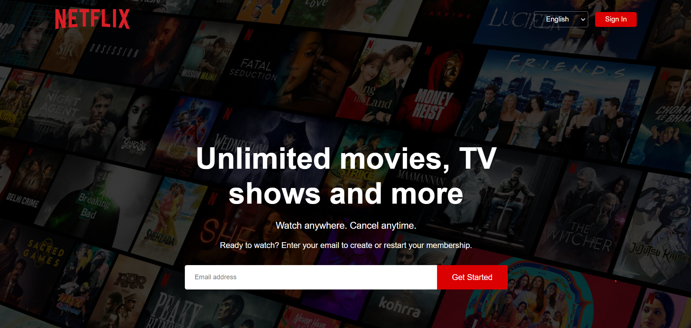

# Netflix Official Website Clone

This repository contains a clone of the official Netflix website created using HTML and CSS. The project aims to showcase web development skills by replicating the user interface and design of the popular streaming platform, Netflix.

## Features

- Responsive design for various screen sizes, providing an optimal viewing experience on desktops, tablets, and smartphones.
- Re-created Netflix landing page layout, including the navigation bar, hero section, content categories, and more.
- Custom CSS styles to mimic the visual aesthetics of the official Netflix website.

## Demo

Check out the live demo of the Netflix Official Website Clone [here](https://your-username.github.io/netflix-clone).

## Installation

1. Clone the repository: `https://github.com/AGRAH-M-V/NetflixClone.git`
2. Navigate to the project directory: `cd NetflixClone`

## Usage

Open the `index.html` file in your preferred web browser to view the Netflix Official Website Clone.

## Contributing

Contributions are welcome! If you find any issues or want to enhance the project, feel free to create a pull request.

## Credits

- Original Netflix design and UI are the property of Netflix, Inc.
- This project is for educational purposes and does not imply any affiliation with or endorsement by Netflix, Inc.
